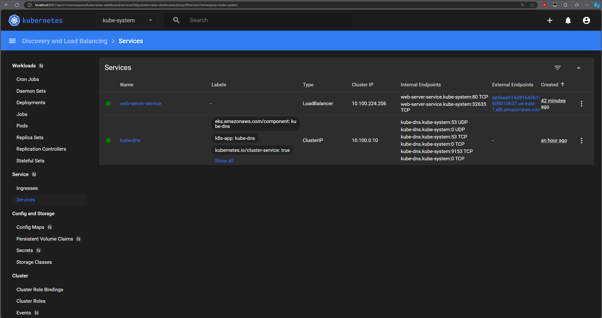
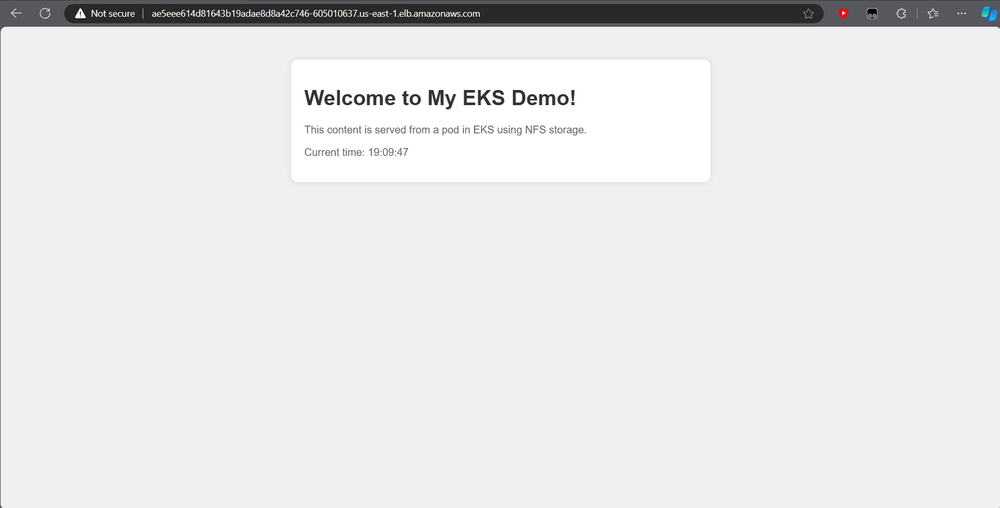

# Lab 5 – Containers and Kubernetes

## Basics

- **Introduction to containers, e.g., Docker**: [Docker Get Started](https://docs.docker.com/get-started/)
  - Lightweight virtualization
  - Key concepts:
    - Dockerfile, Image, Container, Image repositories
- **Kubernetes, container orchestration**: [Kubernetes Overview](https://kubernetes.io/docs/concepts/overview/what-is-kubernetes/)
  - Cluster, Pods, Services, etc.
  - Used to manage a cluster of hosts/containers
  - Why do we need orchestration? What functionalities are provided by Kubernetes (k8s) that exceed those of a simple `dockerd` daemon?
- **Alternative implementations**:
  - Containers: apptainer, podman, lxc
  - Container orchestration: OpenShift, Rancher, Nomad, commercial services: e.g., AWS ECS, Azure AKS, Google GKE

## Prerequisites

- Preferably a Linux environment (Linux VM, or Windows/WSL 2)
- Docker
- Kubernetes cluster. While installing a full-fledged cluster is quite complicated, it’s possible to prepare a development “mini k8s cluster” with the help of:
  - [Minikube](https://minikube.sigs.k8s.io/docs/start): Simple, only 1-node cluster
  - [Kind](https://kind.sigs.k8s.io): Kubernetes in Docker, possible to emulate multiple nodes on a single machine
  - Or others...

## Assignments

### 1) Dockerize AWS-CLI (3 points)

1. **Create a Dockerfile with aws-cli, built from source files** (using tar.gz file / make).
   - Use a multi-stage build to create a small image. Also use a small base image, e.g., based on Alpine Linux.
   - Read more on Python and Docker multistage build.
   - Follow best practices for writing Dockerfiles. In particular, read about `ADD` or `COPY`.
2. **Build an image based on your Dockerfile and test it**.
   - Use a volume (`-v` option) to make AWS credentials available in the container.

### 2) Kubernetes deployment (5 points)

1. **Create a k8s cluster using Amazon Elastic Kubernetes Service (EKS)**.
   - You can also use minikube, kind, or any other Kubernetes distribution, or existing cluster.
   - Minikube, by default, uses its own internal Docker daemon. This daemon doesn’t know anything about images built previously. Prepare your environment by directing it to access the internal Docker daemon by using the `$(minikube docker-env)` command and rebuild your images. This way, images will be available within the k8s cluster.
     - [Guide on using local Docker images with Minikube](https://medium.com/bb-tutorials-and-thoughts/how-to-use-own-local-docker-images-with-minikube-2c1ed0b0968)

2. **Using Helm, install an NFS server and provisioner in the cluster**.
   - Go to `charts/nfs-server-provisioner` for a README.
   - Pay attention to configuration parameters, in particular, override `storageClass.name` which denotes the name of the `StorageClass` that you’ll have to use when creating Persistent Volume Claims.

3. **Create a Persistent Volume Claim** which will bind to an NFS Persistent Volume provisioned dynamically by the provisioner installed in the previous step.

4. **Create a Deployment with an HTTP server** (e.g., Apache or Nginx).
   - The web content directory should be mounted as a volume using the PVC created in the previous step.

5. **Create a Service** associated with the Pod(s) of the HTTP server Deployment.

6. **Create a Job** which mounts the PVC and copies a sample content through the shared NFS PV.

7. **Test the HTTP server** by showing the sample web content in a browser.

# My solutions

## Task 1

I created a Dockerfile to build and run the AWS CLI from source files using a multi-stage build process. My approach, combined with a lightweight Alpine Linux base image, minimizes the image size by isolating build dependencies and only including essential runtime components in the final image.

```Dockerfile
# Stage 1: Build the AWS CLI from source
FROM alpine:3.18 AS builder

RUN apk update && apk add --no-cache cmake make gcc g++ musl-dev libffi-dev python3-dev
RUN apk add --no-cache python3 py3-pip curl tar gzip make gcc musl-dev libffi-dev openssl-dev

WORKDIR /aws-cli
RUN curl -L "https://github.com/aws/aws-cli/archive/refs/tags/2.13.1.tar.gz" -o awscli.tar.gz && \
    tar -xzvf awscli.tar.gz --strip-components=1

RUN pip install .

# Stage 2: Create a minimal runtime image
FROM alpine:3.18

RUN apk add --no-cache python3 py3-pip

COPY --from=builder /usr/lib/python3.11/site-packages /usr/lib/python3.11/site-packages
COPY --from=builder /usr/bin/aws /usr/bin/aws

ENTRYPOINT ["aws"]
```

## Why I Believe This Dockerfile Results in a Small Image

- **Multi-Stage Build**: Using multi-stage builds keeps the build dependencies separate from runtime, so the final image is free from unnecessary tools and libraries.

- **Alpine Linux Base**: Both stages use Alpine Linux, a lightweight distribution that reduces the overall image size.

- **Minimal Dependencies**: Only essential runtime dependencies (`python3` and `py3-pip`) are installed in the final stage, reducing the bloat from unused build dependencies.

- **Selective `COPY` Commands**: By only copying the required `site-packages` and `aws` binary, I avoided including unnecessary files, further reducing the image size.

**Image Size**: 245.13 MB

## Task 2
Most of the actions detailed in the separated report were performed in the Kubernetes Dashboard for convenience. However, below is an alternative approach to complete the exercise using commands only.



Commands Approach:

## Step 1: Creation of EKS Cluster

```bash
cat << EOF > cluster.yaml
apiVersion: eksctl.io/v1alpha5
kind: ClusterConfig

metadata:
  name: Lab5_Spyra
  region: us-east-1

nodeGroups:
  - name: ng-1
    instanceType: t3.medium
    desiredCapacity: 2
    volumeSize: 20
EOF

eksctl create cluster -f cluster.yaml

aws eks update-kubeconfig --name Lab5_Spyra --region us-east-1

kubectl get nodes
```

## Step 2: Installation of NFS Server Provisioner

```bash
helm repo add nfs-ganesha-server-and-external-provisioner https://kubernetes-sigs.github.io/nfs-ganesha-server-and-external-provisioner/

helm repo update

helm install nfs-server-provisioner nfs-ganesha-server-and-external-provisioner/nfs-server-provisioner \
  --set storageClass.name=nfs-storage \
  --set storageClass.defaultClass=true

kubectl get pods | grep nfs-server
kubectl get sc | grep nfs-storage
```

## Step 3: Creation of Persistent Volume Claim

```bash
cat << EOF > pvc.yaml
apiVersion: v1
kind: PersistentVolumeClaim
metadata:
  name: web-content-pvc
spec:
  accessModes:
    - ReadWriteMany
  storageClassName: nfs-storage
  resources:
    requests:
      storage: 1Gi
EOF

kubectl apply -f pvc.yaml

kubectl get pvc web-content-pvc
```

## Step 4: Creation of Web Server Deployment

```bash
cat << EOF > deployment.yaml
apiVersion: apps/v1
kind: Deployment
metadata:
  name: web-server
spec:
  replicas: 1
  selector:
    matchLabels:
      app: web-server
  template:
    metadata:
      labels:
        app: web-server
    spec:
      containers:
      - name: nginx
        image: nginx:latest
        ports:
        - containerPort: 80
        volumeMounts:
        - name: web-content
          mountPath: /usr/share/nginx/html
      volumes:
      - name: web-content
        persistentVolumeClaim:
          claimName: web-content-pvc
EOF

kubectl apply -f deployment.yaml

kubectl get pods -l app=web-server
```

## Step 5: Creation of Service

```bash
cat << EOF > service.yaml
apiVersion: v1
kind: Service
metadata:
  name: web-server-service
spec:
  type: LoadBalancer
  selector:
    app: web-server
  ports:
  - port: 80
    targetPort: 80
EOF

kubectl apply -f service.yaml

kubectl get svc web-server-service
```

## Step 6: Creation of Job to Copy Content

```bash
cat << EOF > job.yaml
apiVersion: batch/v1
kind: Job
metadata:
  name: content-copy
spec:
  template:
    spec:
      containers:
      - name: content-copy
        image: busybox
        command: ["/bin/sh", "-c"]
        args:
        - |
          echo '' > /data/index.html
          echo '' >> /data/index.html
          echo 'Welcome to My EKS Demo!' >> /data/index.html
          echo 'This content is served from a pod in EKS using NFS storage.' >> /data/index.html
          echo 'Current time: $(date)' >> /data/index.html
          echo '' >> /data/index.html
        volumeMounts:
        - name: web-content
          mountPath: /data
      restartPolicy: Never
      volumes:
      - name: web-content
        persistentVolumeClaim:
          claimName: web-content-pvc
EOF

kubectl apply -f job.yaml

kubectl get jobs content-copy
```

## It has worked!



## Clean Up

```bash
kubectl delete service web-server-service
kubectl delete deployment web-server
kubectl delete job content-copy
kubectl delete pvc web-content-pvc
helm uninstall nfs-server-provisioner

eksctl delete cluster --name Lab5_Spyra --region us-east-1
```